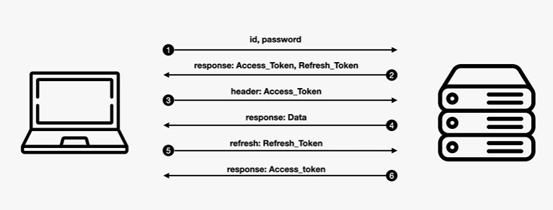

# 프로젝트 구성 및 환경설정
<details>
<summary>접기/펼치기</summary>
<br>

## [Slog Fastify Prisma Server](indiecoder-slog-fastify-prisma-server/INSTALL.md)
## [Slog Svelte Frontend](indiecoder-slog-svelte3-frontend/INSTALL.md)
## [Slog Tailwindcss](indiecoder-slog-tailwindcss/INSTALL.md)

</details>
<br>

# 기본 레이아웃 컴포넌트 구성
<details>
<summary>접기/펼치기</summary>
<br>

## 디렉토리 및 파일 구성
src/components 디렉토리 하위에 10개 컴포넌트를 구성한다.  
```
설치경로
├─ node_modules
├─ public
├─ scrtips
├─ src
│  ├─ components // 디렉토리 생성(하위 포함)
│  │  ├─ Article.svelte
│  │  ├─ ArticleAddForm.svelte
│  │  ├─ ArticleEditForm.svelte
│  │  ├─ ArticlHeader.svelte
│  │  ├─ ArticlList.svelte
│  │  ├─ ArticlLoading.svelte
│  │  ├─ AuthHeader.svelte
│  │  ├─ AuthRegister.svelte
│  │  ├─ Comment.svelte
│  │  ├─ CommentList.svelte
│  ├─ styles
│  │  └─ main.css
│  ├─ App.svelte
│  └─ Main.svelte
├─ index.html
├─ package.json
└─ rollup.config.js
```

### 전역 css 적용
indiecoder-slog-tailwindcss 프로젝트 dist 디렉토리 하위의 [main.css](indiecoder-slog-tailwindcss/dist/main.css) 파일을  
indiecoder-slog-svelte3-frontend 프로젝트의 src/styles 디렉토리 하위로 복사한다.  

indiecoder-slog-svelte3-frontend 프로젝트의 [src/main.js](indiecoder-slog-svelte3-frontend/src/main.js) 파일(엔트리포인트)의 최상단에 해당 css 파일을 import한다
```js
import './styles/main.css'
```

### 컴포넌트 레이아웃 스케폴딩
indiecoder-slog-tailwindcss 프로젝트 dist 디렉토리 하위의 마크업 파일 기준으로 적용한다.   
각 컴포넌트는 아래 표의 Html파일의 주석의 시작과 끝에 해당하는 영역을 분리하여 구성한다.  

#### articles.html
| 컴포넌트                | HTML 파일      | 주석                                  |
| ---------------------- | ------------- | ------------------------------------ |
| Article.svelte         | articles.html | slog-content-box (start ~ end)       |
| ArticleAddForm.svelte  | articles.html | slog-addForm (start ~ end)           |
| ArticleEditForm.svelte | articles.html | slog-content-edit-form (start ~ end) |
| ArticleHeader.svelte   | articles.html | header (start ~ end)                 |
| ArticleList.svelte     | articles.html | slog-list-wrap (start ~ end)         |
| ArticleLoading.svelte  | articles.html | loading-box (start ~ end)            |

#### login.html
| 컴포넌트             | HTML 파일   | 주석                        |
| ------------------- | ---------- | -------------------------- |
| AuthHeader.svelte   | login.html | main-header (start ~ end)  |
| AuthLogin.svelte    | login.html | login-box (start ~ end)    |
| AuthRegister.svelte | login.html | register-box (start ~ end) |

#### comments.html
| 컴포넌트            | HTML 파일      | 주석                             |
| ------------------ | ------------- | ------------------------------- |
| Comment.svelte     | comments.html | comment (start ~ end)           |
| CommentList.svelte | comments.html | slog-comment-wrap (start ~ end) |

</details>
<br>

# Router와 Tinro
<details>
<summary>접기/펼치기</summary>
<br>

svelte는 router를 기본적으로 제공하지 않는다.  
대신 다양한 기능의 router를 플러그인으로 설치할 수 있고, 개발자는 필요에 따라 라우터를 선별해서 사용하면 되며, 강의에서는 Tinro 라는 라우터 플러그인 패키지를 설치하여 사용한다.  
(svelte의 확장 프레임워크인 SvelteKit에는 라우터를 제공한다.)  

```bash
npm install -D tinro
```

## 디렉토리 및 파일 구성
src/pages 디렉토리 하위에 4개 컴포넌트를 구성한다.  
```
설치경로
├─ node_modules
├─ public
├─ scrtips
├─ src
│  ├─ components
│  ├─ pages // 디렉토리 생성(하위 포함)
│  │  ├─ Articles.svelte
│  │  ├─ Comments.svelte
│  │  ├─ Login.svelte
│  │  ├─ notFound.html.svelte
│  │  └─ Register.svelte
│  ├─ styles
│  │  └─ main.css
│  ├─ App.svelte
│  ├─ Main.svelte
│  └─ router.svelte // 생성
├─ package.json
└─ rollup.config.js
```

### [Articles.svelte](indiecoder-slog-svelte3-frontend/src/pages/Articles.svelte)
```svelte
<script>
  import ArticleHeader from "../components/ArticleHeader.svelte";
  import ArticleList from "../components/ArticleList.svelte";
  import ArticleAddForm from "../components/ArticleAddForm.svelte";
</script>

<ArticleHeader />
<main class="slog-main">
  <ArticleAddForm />
  <ArticleList />
</main>
```

### [Login.svelte](indiecoder-slog-svelte3-frontend/src/pages/Login.svelte)
```svelte
<script>
  import AuthHeader from "../components/AuthHeader.svelte";
  import AuthLogin from "../components/AuthLogin.svelte";
</script>
<AuthHeader />
<main class="auth-box">
  <AuthLogin />
</main>
```
### [Register.svelte](indiecoder-slog-svelte3-frontend/src/pages/Register.svelte)
```svelte
<script>
  import AuthHeader from "../components/AuthHeader.svelte";
  import AuthRegister from "../components/AuthRegister.svelte";
</script>
<AuthHeader />
<main class="auth-box">
  <AuthRegister />
</main>
```
### [notFound.svelte](indiecoder-slog-svelte3-frontend/src/pages/notFound.svelte)
indiecoder-slog-tailwindcss 프로젝트 dist 디렉토리 하위의 not-found.html 마크업 파일 기준으로 적용한다.  
```svelte
<!-- not-found.html -->
<!-- 404 page start -->
<div class="not-found-full-box">
  <h1>404 Not Found</h1>
</div><!-- 404 page end -->    
```


pages 디렉토리를 생성하고, 그 하위에 라우팅에 의해 화면에 표시되는 컴포넌트들을 주제별로 구성한다.  
pages 디렉토리와 동일한 레벨에 router.svelte를 생성한다.  
해당 컴포넌트에 라우팅과 관련된 코드가 작성된다.  

- [router.svelte](indiecoder-slog-svelte3-frontend/src/router.svelte)
  ```svelte
  <script>
    import { Route } from 'tinro'
    import Articles from './pages/Articles.svelte';
    import Login from './pages/Login.svelte';
    import Register from './pages/Register.svelte';
    import NotFound from './pages/notFound.svelte';
  </script>
  <Route path="/" redirect="/articles/all" />
  <Route path="/articles/*" ><Articles/></Route>
  <Route path="/login" ><Login/></Route>
  <Route path="/register" ><Register/></Route>
  <Route fallback ><NotFound/></Route>
  ```
trino로 부터 Route를 import하여 해당 컴포넌트를 선언하여 path 속성에 라우팅할 주소를, 해당 주소 요청이 들어오면 렌더링 할 컴포넌트를 Route 컴포넌트의 자식 컴포넌트로 지정해준다.  
기본주소로 접근하는 사용자에게는 redirect를 이용해 articles로 이동하게 설정한다.
comment의 경우 articles의 하위 라우터로 배치될 예정이므로 주소 끝에 *를 표시해 둔다.  

- [App.svelte](indiecoder-slog-svelte3-frontend/src/App.svelte)
  ```svelte
  <script>
    import Router from "./router.svelte";
  </script>
  <div class="main-comtainer">
    <Router />
  </div>
  ```
  App.svelte 컴포넌트에서 해당 컴포넌트를 import 하여 배치하면, 배치한 영역에 출력되게 된다.

- http://127.0.0.1:5173
- http://127.0.0.1:5173/login
- http://127.0.0.1:5173/register
- http://127.0.0.1:5173/임의의주소(notfound)

</details>
<br>

# Ajax 통신과 Axios
<details>
<summary>접기/펼치기</summary>
<br>

백엔드 서버와 REST API를 이용한 통신이 필요하다.  
자바스크립트에서 Ajax 통신을 하는 대표적 방법으로 fetch와 Axios가 있다.  

- fetch: 자바스크립트 기본 API
- Axios: 외부 플러그인
기본 fetch도 괜찮지만 Axios의 경우 좀 더 다양한 옵션들이 있어 서버와 통신하는 데 많은 편의성을 제공한다.  

## axios 설치
```bash
npm install axios
```

### 기본 사용 방법
```js
axios.get("http://localhost:3000/api/articles", {
  headers: {
    X-Auth-Token: '###'
  }
})
axios.get("http://localhost:3000/api/likes", {
  headers: {
    X-Auth-Token: '###'
  }
})
axios.post("http://localhost:3000/api/article", 
  {
    content: "###"
  },
  {
    headers: {
    X-Auth-Token: '###'
    }
  }
)
```

### 코드 공통화
해당 서비스의 정해진 보안 정책을 기준으로 api 호출 메소드를 공통화 시키면 아래와 같이 코드가 간결해진다.  
```js
getApi({path: '/articles'});
getApi({path: '/likes'});
const options = {
  path: '/articles',
  data: {
    email: '###'
  }
}
getApi(options);
```

#### 디렉토리 및 파일 구성
src 디렉토리 하위에 service 디렉토리를 구성하고 그 하위에 api.js 를 만든다.
```
설치경로
├─ node_modules
├─ public
├─ scrtips
├─ src
│  ├─ components
│  ├─ pages
│  ├─ service // 디렉토리 생성(하위 포함)
│  │  └─ api.js // 생성
│  ├─ styles
│  │  └─ main.css
│  ├─ App.svelte
│  ├─ Main.svelte
│  └─ router.svelte
├─ index.html
├─ package.json
└─ rollup.config.js
```
- [api.js](indiecoder-slog-svelte3-frontend/src/service/api.js)
  ```js
  import axios from 'axios'

  const send = async ({method='', path='', data={}, access_token=''} = {}) => {
    const commonUrl = 'http://localhost:3000'
    const url = commonUrl + path

    const headers = {
      "Access-Control-Allow-Origin": commonUrl, // cross domain 이슈 대응 옵션
      "Access-Control-Allow-Credentials": true, // 
      "content-type": "application/json;charset=UTF-8", // 송수신 데이터 타입
      "accept": "application/json,",
      "SameSite": "None", // 인증시 사용할 쿠키를 위한 설정
      "Authorization": access_token // 토큰정보 전송
    }
    const options = {
      method,
      url,
      headers,
      data,
      withCredentials: true, // 프론트,백엔드 서버의 포트가 다른 형태에 서버 쿠키를 공유하기 위한 설정
    }

    try {
      const response = await axios(options);
      return response.data
    } catch (error) {
      throw error
    }
  }

  const getApi = ({path='', access_token=''} = {}) => {
    return send({method: 'GET', path, access_token})
  }
  const putApi = ({path='', data={} access_token=''} = {}) => {
    return send({method: 'PUT', path, data, access_token})
  }
  const postApi = ({path='', data={} access_token=''} = {}) => {
    return send({method: 'POST', path, data, access_token})
  }
  const delApi = ({path='', data={} access_token=''} = {}) => {
    return send({method: 'DELETE', path, data, access_token})
  }
  export {
    getApi,
    putApi,
    postApi,
    delApi
  }
  ```
강의 코드에서는 headers 옵션에 `Access-Control-Allow-Origin`와 `Access-Control-Allow-Credencials` 이라는 CORS 관련 옵션을 요청 헤더에 담아 보내는데, 백엔드 서버에서 응답 헤더에 담아 반환하는 설정값이먀, SameSite의 경우 Cookie에 설정하는 값이기 때문에 백엔드에서 요청 헤더로 부터 꺼내서 다시 세팅하지 않는 이상 사실 이 헤더값은 무의미하다고 봐도 무방하다.  

</details>
<br>

# Store 구성
<details>
<summary>접기/펼치기</summary>
<br>

Store는 전역으로 사용할 수 있는 상태값이다.  

## 디렉토리 및 파일 구성
src 디렉토리 하위에 stores 디렉토리를 구성하고 그 하위에 index.js 를 만든다.
```
설치경로
├─ node_modules
├─ public
├─ scrtips
├─ src
│  ├─ components
│  ├─ pages
│  ├─ service
│  ├─ stores // 디렉토리 생성(하위 포함)
│  │  └─ index.js.js // 생성
│  ├─ styles
│  │  └─ main.css
│  ├─ App.svelte
│  ├─ Main.svelte
│  └─ router.svelte
├─ index.html
├─ package.json
└─ rollup.config.js
```

### store 모듈 스켈레톤 코드
- src/stores/index.js
  ```js
  import { writable, get } from 'svelte/store'
  import { getApi, putApi, delApi, postApi } from '../service/api.js'
  import { router } from 'tinro'

  function setCurrentArticlesPage() {}
  function setArticles() {}
  function setLoadingArticle() {}
  function setArticleContent() {}
  function setComments() {}
  function setAuth() {}
  function setArticlesMode() {}
  function setIsLogin() {}

  export const currentArticlesPage = setCurrentArticlesPage()
  export const articles = setArticles()
  export const loadingArticle = setLoadingArticle()
  export const articleContent = setArticleContent()
  export const comments = setComments()
  export const auth = setAuth()
  export const articlesMode = setArticlesMode()
  export const isLogin = setIsLogin()
  ```

## store별 기능

| store               | 설명                                                                                                           |
| ------------------- | -------------------------------------------------------------------------------------------------------------- |
| currentArticlesPage | 게시물 스크롤 시 페이지 증가를 관리하는 스토어                                                                       |
| articles            | 서비스의 가장 메인이 되는 스토어<br>articles라는 게시물 목록이 누적되며 게시물 수정·삭제와 관련된 사용자 정의 메소드를 가진다.<br>좋아요나 코멘트를 추가했을 때 상태를 변경해주는 사용자 정의 메소드 등을 포함한다. |
| loadingArticle      | 게시물 데이터를 조회할 때 서버와 통신 중이라면 로딩 상태를 표시하는 기능을 하는 스토어                                     |
| articleContent      | 게시물 단건에 대한 정보만을 담는 스토어                                                                              |
| comments            | 특정 게시물의 Comment를 담는 스토어<br>코멘트 추가, 수정, 삭제 등을 처리하는 사용자 정의 메소드를 가진다.                   |
| auth                | 로그인된 유저의 정보를 담는 스토어<br>로그인, 로그아웃, 회원가입 등의 사용자 정의 메소드를 가진다.                           |
| articlesMode        | 보기 상태를 나타내는 스토어<br>보기 모드: [모두보기, 좋아요보기, 내글보기]                                               |
| isLogin             | 로그인 상태 여부를 확인하는 스토어                                                                                   |

</details>
<br>

# 인증 기능
<details>
<summary>접기/펼치기</summary>
<br>

## 인증 방식 종류
- 세션방식: 로그인 패스워드 정보를 서버에 전달하여 세션에 의지하여 인증 유무를 파악  
- 토큰방식: 인증 토큰을 통해 인증 유무를 파악  

### 토큰 방식
토큰은 일반적으로 액세스토큰과 리프레시토큰으로 나뉘며, 둘의 가장 큰 차이점은 토큰의 만료시간이 다르다는 점이다.  
액세스토큰은 사용자 정보가 들어있는 암호화된 토큰으로, 15분에서 1시간 정도로 매우 짧은 만료시간을 갖는다.  
액세스 토큰이 만료될 쯤 리프레시 토큰을 이용하여 액세스 토큰을 재발급 받아 로그인을 유지한다.  
따라서 리프래시 토큰은 1주 혹은 그 이상의 만료시간으로 설정하여 사용하는 경우가 많다.
인증의 메인으로 사용되는 액세스 토큰이 해커에 의해 탈취되더라도 해당 토큰의 만료 시간이 짧아 사용하기 힘들게 하기 위함이다.  

두 토큰의 저장 위치는 다르게 적용된다.  
액세스 토큰은 클라이언트의 메모리(JS 변수)에 저장되어 필요한 요청이 발생하면 바로 사용할 수 있게 준비한다.  
svelte에서는 store에 저장하여 필요에 따라 불러 사용한다.  
리프레시 토큰은 http-only 옵션이 적용된 쿠키 즉, 로컬에 저장한다.  
http-only로 저장된 쿠키는 브라우저에서 자바스크립트를 이용해 로드할 수 없고, 서버의 요청을 통해서만 읽거나 쓸 수 있어 보안에 강화

- access token  
  - 사용자 정보가 들어있는 암호화된 토큰  
  - 15분 ~ 1시간 정도로 매우 짧은 만료시간  
  - 클라이언트 메모리(JS 변수)에 저장
- refresh token  
  - 액세스 토큰이 만료되었을 경우 재발급 하기위한 토큰
  - 1주 혹은 그 이상의 만료시간
  - 쿠키(http-only)에 저장
    - 자바스클비트로 로드 불가능

## 인증 과정 

1. id와 password를 서버에 전달하여 로그인 인증 시도  
2. 서버에 전달된 id와 패스워드 값이 정상일 경우 서버는 클라이언트에 RefreshToken과 AccessToken을 전달
  - RefreshToken: setCookie 옵션을 통해 http-only 상태로 저장
  - AccessToken: return할 store에 저장
3.  클라이언트가 서버로 정보를 요청할 일이 발생한다면 AccessToken을 header에 담아 함께 서버로 전송
4. 서버에서는 header로 넘겨받은 AccessToken 상태를 확인하고 정상일 경우 클라이언트가 요청한 정보를 반환
5. 설정된 AccessToken 만료시간이 가까워질 경우 클라이언트는 RefreshToken을 이용해 서버에 AccessToken 재발급 요청
6. RefreshToken 상태가 정상일경우 서버는 재발급된 AccessToken을 클라이언트에 반환

이렇게 재발급 받은 AccessToken을 이용하여 필요한 요청이 가능

### Auth Store 구현

#### 스켈레톤 코드
- 
```js
function setAuth() {
  let initValues = {
    id: '',
    email: '',
    Authrization: ''
  }
  const { subscribe, set, update } = writable({...initValues})
  const refresh = async () => {}
  const resetUserInfo = () => {}
  const login = async () => {}
  const logout = async () => {}
  const register = async () => {}

  return {
    subscribe,
    refresh,
    login,
    logout,
    resetUserInfo,
    register
  }
}
```
writable을 초기화 할 객체인 initValue를 정의한다.  
initValue에는 사용자 정보와 Authorization을 초기화 상태로 만들어주는데, Authorization이 바로 AccessToken이 된다.  
writable에 initValue를 그냥 넘기지 않고 전개하는 이유는 writable에서 참조를 끊어(복제) 추후 같은 변수로 초기화 시킬 수 있기 때문이다.  


| 함수           | 설명                                            |
| ------------- | ----------------------------------------------- |
| refresh       | refreshToken을 이용 AccessToken 요청 메소드        |
| resetUserInfo | auth store 초기화 메소드                          |
| login         | 로그인 기능 메소드                                 |
| logout        | 로그아웃 기능 메소드                               |
| register      | 회원가입 기능 메소드                               |

위 5가지 기능의 메소드와 함께 subscribe를 포함하여 내보낸다.  
set, update의 경우 store 외부에서 굳이 store를 조작할 필요가 없기 때문에 내보내지 않는다.  

</details>
<br>

# Template
<details>
<summary>접기/펼치기</summary>
<br>

</details>
<br>